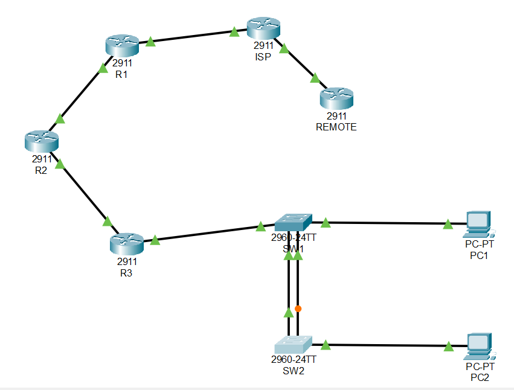
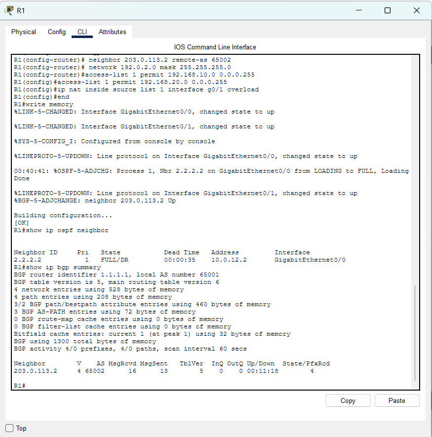
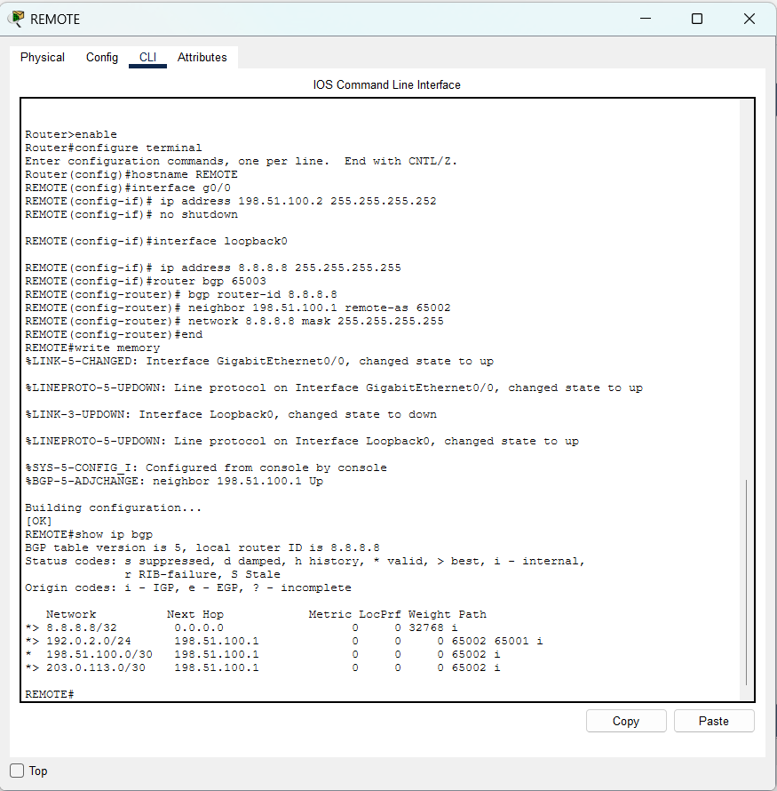
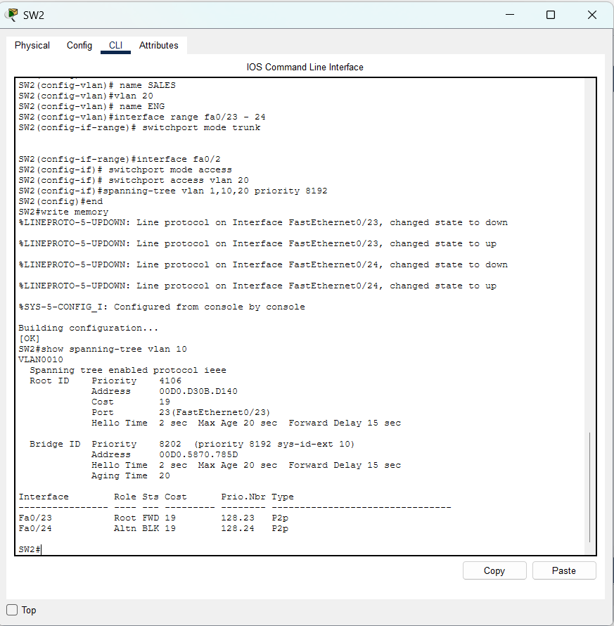
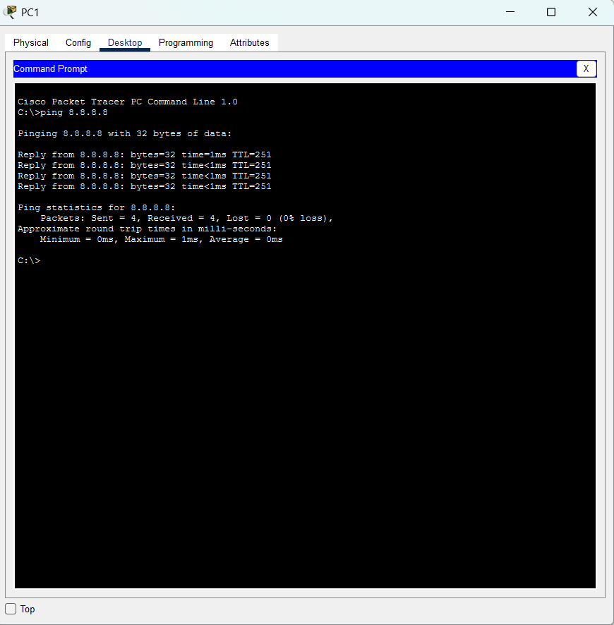
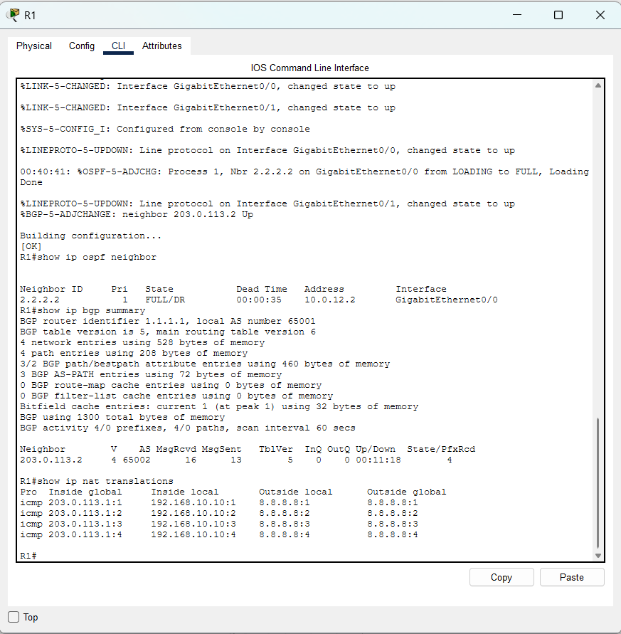
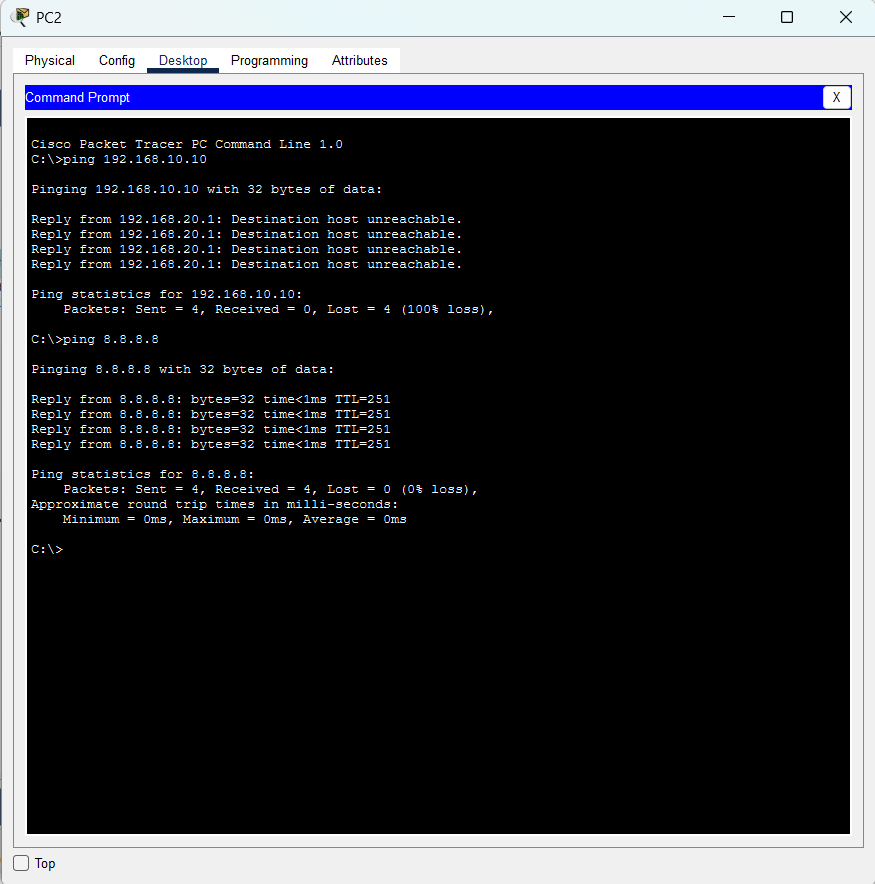

# Enterprise Multi-AS Datacom Network Lab

A production-grade enterprise routing, switching, and security topology designed and simulated in Cisco Packet Tracer. The architecture spans three Autonomous Systems and implements hierarchical interior routing, multi-homed inter-domain routing, redundant layer 2 loop protection, segmentation, and perimeter NAT/ACL security policies.

---

## Topology Architecture

### Design Specifications
- **Autonomous Systems:**
  - **AS 65001 (Enterprise Core/Edge):** Enterprise network running internal OSPF multi-area routing and edge eBGP peering.
  - **AS 65002 (Transit ISP):** Intermediate provider transit network exchanging routes between customer and remote domains.
  - **AS 65003 (Remote / Cloud Destination):** Simulates external internet loopback endpoints (`8.8.8.8/32`).
- **Interior Routing (IGP):**
  - **Multi-Area OSPF (Process 1):** Backbone Area 0 (`10.0.12.0/30`) and Enterprise Access Area 1 (`10.1.23.0/30`, `192.168.10.0/24`, `192.168.20.0/24`).
  - **Area Border Router (ABR):** R2 interconnects Area 0 and Area 1.
  - **Default-Information Originate:** R1 injects a default route dynamically throughout the OSPF domain.
- **Layer 2 Switching & Redundancy:**
  - **802.1Q VLAN Segmentation:** VLAN 10 (SALES - `192.168.10.0/24`) and VLAN 20 (ENG - `192.168.20.0/24`).
  - **Router-on-a-Stick (RoaS):** Sub-interfaces `G0/1.10` and `G0/1.20` on R3 provide inter-VLAN default gateway termination.
  - **Spanning Tree Protocol (STP):** Dual trunk links (`Fa0/23`, `Fa0/24`) between SW1 and SW2 with deterministic root bridge priority configuration (`SW1` priority 4096, `SW2` priority 8192) preventing layer 2 switching loops.
- **Security & Edge Services:**
  - **Extended Access Control List (ACL):** Enforced on R3 inbound sub-interface `G0/1.20` (`BLOCK-ENG-TO-SALES`), blocking lateral ENG traffic to SALES while permitting outbound internet transit.
  - **Port Address Translation (PAT / NAT Overload):** R1 translates all private internal subnets (`192.168.0.0/16`) to the public egress interface `G0/1` (`203.0.113.1`).

---

## IP Addressing Plan

| Device | Interface | IP Address | Subnet Mask | Description / Role |
| :--- | :--- | :--- | :--- | :--- |
| **R1** | G0/0 | 10.0.12.1 | 255.255.255.252 | Point-to-Point (OSPF Area 0 to R2) |
| **R1** | G0/1 | 203.0.113.1 | 255.255.255.252 | Egress / NAT Outside (eBGP to ISP) |
| **R2** | G0/0 | 10.0.12.2 | 255.255.255.252 | Point-to-Point (OSPF Area 0 to R1) |
| **R2** | G0/1 | 10.1.23.1 | 255.255.255.252 | Point-to-Point (OSPF Area 1 to R3) |
| **R3** | G0/0 | 10.1.23.2 | 255.255.255.252 | Point-to-Point (OSPF Area 1 to R2) |
| **R3** | G0/1.10 | 192.168.10.1 | 255.255.255.0 | Gateway for VLAN 10 (SALES) |
| **R3** | G0/1.20 | 192.168.20.1 | 255.255.255.0 | Gateway for VLAN 20 (ENG) |
| **ISP** | G0/0 | 203.0.113.2 | 255.255.255.252 | eBGP Peering with R1 (AS 65001) |
| **ISP** | G0/1 | 198.51.100.1 | 255.255.255.252 | eBGP Peering with REMOTE (AS 65003) |
| **REMOTE**| G0/0 | 198.51.100.2 | 255.255.255.252 | eBGP Peering with ISP (AS 65002) |
| **REMOTE**| Loopback0 | 8.8.8.8 | 255.255.255.255 | Simulated Internet Endpoint |
| **PC1** | Fa0 | 192.168.10.10 | 255.255.255.0 | VLAN 10 Client (Default Gateway: 192.168.10.1) |
| **PC2** | Fa0 | 192.168.20.10 | 255.255.255.0 | VLAN 20 Client (Default Gateway: 192.168.20.1) |

---

## Verification & Validation

### 1. OSPF Adjacency and eBGP Peering (R1)
Validation of full OSPF neighbor states (`FULL/DR`) and active eBGP state with ISP receiving advertised prefixes.

### 2. Multi-AS Path Traversal (REMOTE - AS 65003)
Displaying BGP table showing the enterprise prefix `192.0.2.0/24` learned across multiple autonomous systems (`AS Path: 65002 65001`).

### 3. STP Loop Prevention & Port Roles (SW2)
Demonstrating spanning-tree convergence across redundant inter-switch links, setting `Fa0/24` to `Altn BLK` while `Fa0/23` operates as `Root FWD`.

### 4. End-to-End Connectivity & Dynamic NAT/PAT Translation
ICMP reachability from internal host PC1 to simulated internet endpoint (`8.8.8.8`) verified with active NAT translations on R1 translating private inside local IPs to public IP `203.0.113.1`.

### 5. Extended ACL Inter-VLAN Isolation
Testing traffic isolation between VLAN 20 and VLAN 10. PC2 is blocked from reaching PC1 while retaining outbound connectivity to the internet.

